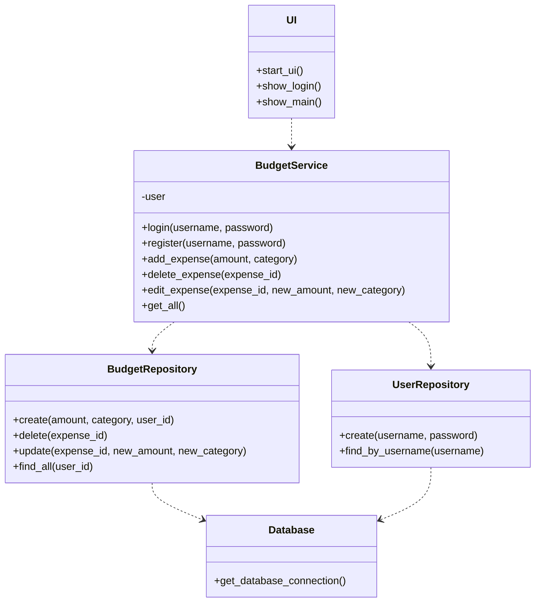
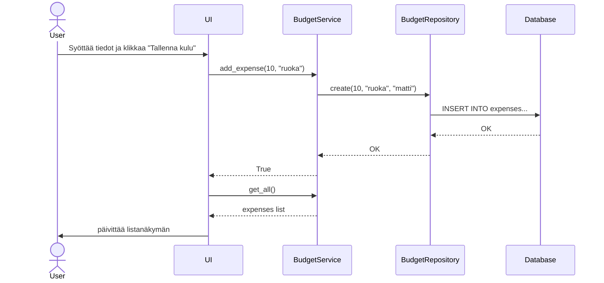
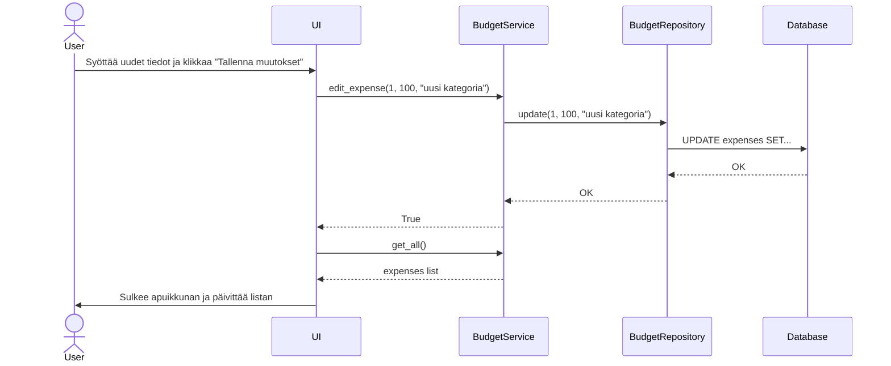

# Arkkitehtuurikuvaus

## Rakenne

Sovelluksen pakkausrakenne noudattaa kolmikerrosarkkitehtuuria, ja koodi on jaettu seuraaviin osiin:

- **ui**: Käyttöliittymästä vastaava koodi
- **services**: Sovelluslogiikka (esim. `BudgetService`)
- **repositories**: Tietojen tallennuksesta vastaava koodi (`BudgetRepository`)
- **database**: Tietokantayhteyden hallinta ja alustus

## Käyttöliittymä

Käyttöliittymä sisältää tällä hetkellä kolme erillistä näkymää:
- Kirjautumis- ja rekisteröitymisnäkymä
- Päänäkymä (budjetin ja kulujen seuranta)
- Apunäkymä kulun muokkaamiselle

Käyttöliittymä on eriytetty täysin omaksi kokonaisuudekseen (`ui.py`), eikä se sisällä lainkaan sovelluslogiikkaa tai tietokantaoperaatioita. Se ainoastaan kutsuu `BudgetService` luokan metodeja ja päivittää näkymää sen palauttamien arvojen perusteella.

## Tietojen pysyväistallennus

Sovelluksen tietojen tallennuksesta vastaavat `BudgetRepository`- ja `UserRepository`-luokat, jotka noudattavat Repository-suunnittelumallia.

Tiedot tallennetaan paikalliseen SQLite-tietokantaan. Tietokannan alustuksesta vastaa `initialize_database.py` ja yhteyden muodostamisesta `database_connection.py`.

Tietokannassa on kaksi taulua:
- `users`: Tallentaa käyttäjien tunnukset ja salasanat.
- `expenses`: Tallentaa yksittäiset kulut (määrä ja kategoria) ja liittää ne käyttäjään ID:llä (`user_id`).

## Luokkakaavio

Tässä on sovelluksen keskeisimpien luokkien suhteita kuvaava luokkakaavio:

## Sovelluslogiikka

Tässä kuvataan sovelluksen toimintaa sekvenssikaavioiden avulla:
### Kulun lisääminen
Kun käyttäjä syöttää kulun tiedot ja klikkaa tallennuspainiketta, ohjelman sisäinen eteneminen tapahtuu seuraavasti:

### Kulun muokkaaminen
Kun käyttäjä valitsee kulun, avaa muokkausikkunan, syöttää uudet tiedot ja tallentaa muutokset, ohjelma etenee seuraavasti:
