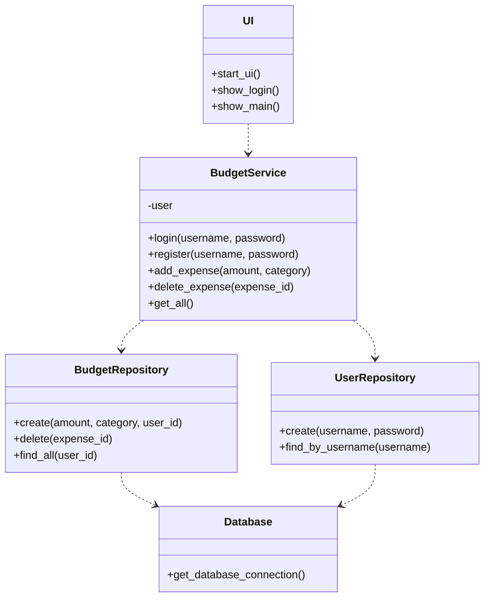
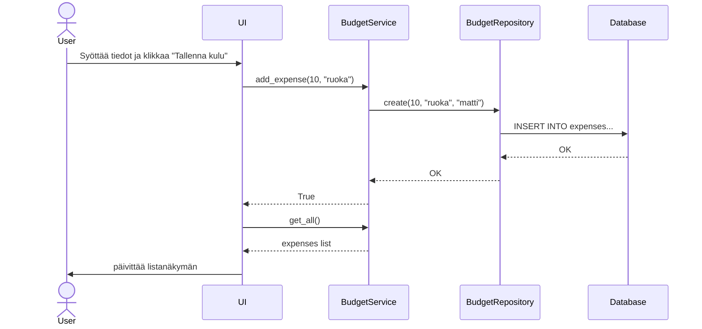

# Arkkitehtuurikuvaus

## Rakenne

Sovelluksen pakkausrakenne noudattaa kolmikerrosarkkitehtuuria, ja koodi on jaettu seuraaviin osiin:

- **ui**: Käyttöliittymästä vastaava koodi
- **services**: Sovelluslogiikka (esim. `BudgetService`)
- **repositories**: Tietojen tallennuksesta vastaava koodi (`BudgetRepository`)
- **database**: Tietokantayhteyden hallinta ja alustus

## Luokkakaavio

Tässä on sovelluksen keskeisimpien luokkien suhteita kuvaava luokkakaavio:

