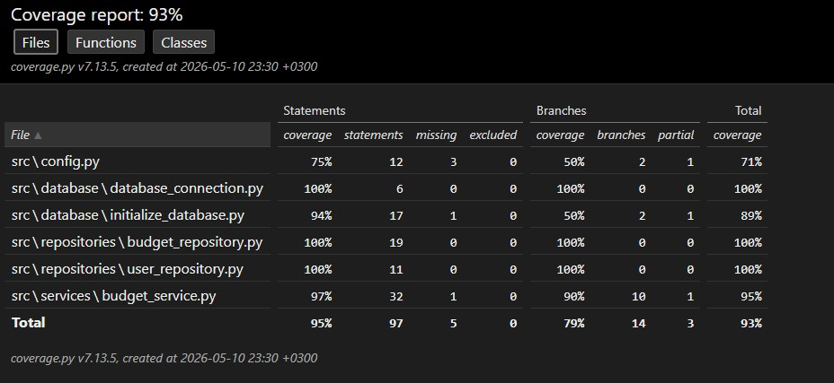

# Testausdokumentti

Ohjelmaa on testattu sekä automatisoiduin yksikkö- ja integraatiotestein unittestilla sekä manuaalisesti tapahtunein järjestelmätason testein.

## Yksikkö- ja integraatiotestaus

### Sovelluslogiikka

Sovelluslogiikasta vastaavaa `BudgetService`-luokkaa testataan [TestBudgetService](src/tests/services/test_budget.py)-testiluokalla. `BudgetService`-olio alustetaan niin, että sille injektoidaan riippuvuuksiksi repositorio-oliot, jotka tallentavat tietoa muistiin pysyväistallennuksen sijaan. Tätä varten testissä on käytössä valeluokat `FakeBudgetRepository` ja `FakeUserRepository`.

Testeissä on varmistettu, että:
* Käyttäjän kirjautuminen ja rekisteröinti toimivat oikein.
* Kuluja voi lisätä, muokata ja poistaa vain kirjautuneena.
* Virheelliset syötteet, kuten negatiiviset summat tai tyhjät kategoriat, hylätään ja ne palauttavat virheestä kertovan ilmoituksen.

### Repositorio-luokat

Repositorio-luokkia `BudgetRepository` ja `UserRepository` testataan oikeaa tietokantayhteyttä vasten integraatiotesteillä. Testeissä käytettävän tietokannan nimi on konfiguroitu `.env.test`-tiedostoon, ja se alustetaan jokaisen testin alussa `initialize_database`-metodilla. `BudgetRepository`-lukkaa testataan [TestRepositories](src/tests/repositories/test_repositories.py)-testiluokalla.

### Testauskattavuus

Käyttöliittymäkerrosta lukuun ottamatta sovelluksen testauksen haarautumakattavuus on 93 %.

### Asennus ja konfigurointi

Sovellus on haettu ja sitä on testattu [käyttöohjeen](./kayttoohje.md) kuvaamalla tavalla.

Sovellusta on testattu tilanteissa, joissa `data`-kansio ja tietokantatiedosto ovat olleet valmiina, sekä tilanteissa, joissa ne puuttuvat, jolloin ohjelma on luonut ne itse konfiguraation mukaisesti.

### Toiminnallisuudet

Kaikki [vaatimusmäärittelyn](./vaatimusmaarittely.md) ja käyttöohjeen listaamat toiminnallisuudet (kirjautuminen, kulujen lisäys, muokkaus ja poisto) on käyty läpi. Syötekenttiä on testattu myös virheellisillä arvoilla.

## Sovellukseen jääneet laatuongelmat

Sovelluksessa on vielä seuraavia kehityskohteita:

- Salasanoja ei hajauteta (hash), vaan ne tallentuvat selväkielisinä, mikä on tietoturvapuute.
- Sovelluksen virheilmoitukset käyttöliittymässä ovat hyvin pelkistettyjä.
- Sovellus on hyvin pelkistetty toiminnallisuudeltaan